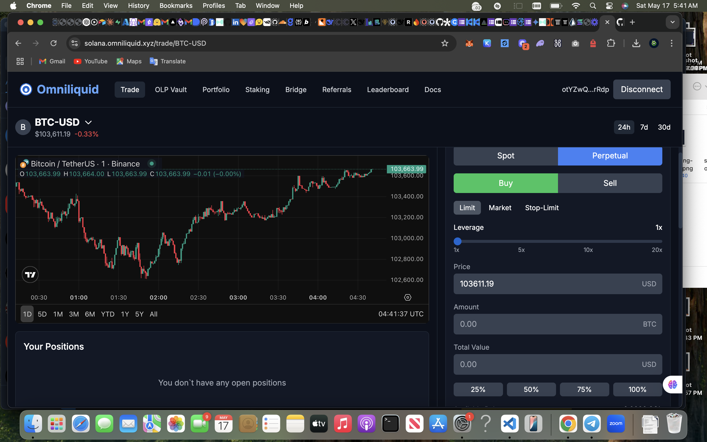

# Omniliquid



## Overview

Omniliquid is a fully decentralized trading platform built on Solana, enabling spot and perpetual markets for a wide range of assets including cryptocurrencies, stocks, forex, bonds, ETFs, commodities, and other real-world assets (RWAs). It utilizes a 100% on-chain Central Limit Order Book (CLOB) model for transparent and efficient price discovery.

[](https://opensource.org/licenses/MIT)
[](https://solana.com/)
[](https://www.anchor-lang.com/)

## Table of Contents

- [Features](#features)
- [Technical Architecture](#technical-architecture)
  - [Core Components](#core-components)
  - [System Overview](#system-overview)
  - [Smart Contract Structure](#smart-contract-structure)
- [Program Structure](#program-structure)
- [Deployment](#deployment)
  - [Deployed Addresses](#deployed-addresses)
- [User Guide](#user-guide)
  - [Depositing Collateral](#depositing-collateral)
  - [OLP Vault](#olp-vault)
  - [Trading](#trading)
  - [Managing Positions](#managing-positions)
  - [Staking OMNI Tokens](#staking-omni-tokens)
- [Developer Guide](#developer-guide)
  - [Environment Setup](#environment-setup)
  - [Building the Project](#building-the-project)
  - [Testing](#testing)
  - [Oracle Integration](#oracle-integration)
  - [Custom Extensions](#custom-extensions)
- [License](#license)

## Features

- **Multi-Asset Support**: Trade crypto, stocks, forex, commodities, and RWAs in a single platform
- **Spot & Perpetual Trading**: Both spot markets and perpetual futures with funding rates
- **On-Chain Order Book**: Fully transparent CLOB model with efficient matching
- **Cross-Margin Trading**: Efficient capital utilization across different positions
- **Advanced Risk Management**: Sophisticated liquidation and insurance systems
- **Synthetic Assets**: Trade synthetic versions of any asset without requiring custody
- **Staking & Governance**: OMNI token for platform governance and fee discounts
- **Oracle Integration**: Reliable price feeds via Pyth Oracle

## Technical Architecture

### Core Components

Omniliquid's architecture consists of several key programs that work together to provide a comprehensive trading platform:

1. **Registry**: Manages supported assets, roles, and program registrations
2. **Trading Storage**: Handles user deposits, withdrawals, and position management
3. **CLOB**: Central Limit Order Book for order matching and execution
4. **Price Router**: Integrates with Pyth oracle for reliable price feeds
5. **OMNI Token**: Platform utility and governance token
6. **OLP Vault**: Liquidity provision and yield generation for token holders

### System Overview

The system follows a modular design pattern where programs have specific responsibilities and interact through well-defined interfaces:

- **User Layer**: Traders interact with Trading Storage to open/close trades
- **Trading Layer**: CLOB handles order matching and execution
- **Settlement Layer**: Trading Storage and OLP Vault handle settlement
- **Risk Layer**: Trading Storage includes liquidation functionality and risk management
- **Infrastructure Layer**: Registry, Oracle, and Price Router provide core services

### Smart Contract Structure

The Solana programs follow a pattern of clear specializations, with secure interactions between components:

- Core interfaces are defined for cross-program communication
- Access control is enforced through the Registry program
- Economic security is maintained through the OLP Vault
- All user balances and positions are stored on-chain for full transparency
- Multi-stage security checks prevent common DeFi vulnerabilities

## Program Structure

```
omniliquid/
├── programs/                     # Solana programs
│   ├── omniliquid-registry/      # Asset and program management
│   ├── omniliquid-trading-storage/  # Handles user positions and collateral
│   ├── omniliquid-clob/          # On-chain order book
│   ├── omniliquid-price-router/  # Price feed integration
│   ├── omniliquid-omni-token/    # Governance token
│   └── omniliquid-olp-vault/     # Protocol treasury and liquidity
├── scripts/                      # Utility scripts
│   ├── deploy.ts                 # Deployment script
│   ├── register-assets.ts        # Registers supported assets
│   ├── initialize-markets.ts     # Sets up trading markets
│   └── fund-test-accounts.ts     # Creates test accounts
├── tests/                        # Test files
├── .env.example                  # Environment variables template
├── Anchor.toml                   # Anchor configuration
└── README.md                     # This file
```

## Deployment

Omniliquid is deployed on Solana Devnet.

### Deployed Addresses

The following programs are deployed:

| Program                | Address                                      |
|------------------------|----------------------------------------------|
| Registry               | 3pjibswEuCbXPtdemyuvDxbTMaGYxsJBG73uZpZajeRK |
| CLOB                   | 573mPaFytnEp1y9oKtHd1aNfwcxRc4ExYY1LthCVR4sX |
| Price Router           | HgecS9wmQf2UutfytswApHsBzddBjFYsAX9VKgcYZAVu |
| Trading Storage        | 8jfjemcxtyZEAYzPWynEjWZPW3wD7e3suw7j2mvajY7A |
| OMNI Token             | CiTbKMyLecpE5LWcB1TkKFPtpnKD4AK1TAedmt4PjTgB |
| OLP Vault              | 6zLE2d1m87joeG1te75Qu19y2Y7irdHkPzToWpxkRjnL |

## User Guide

The Omniliquid platform will be accessible at [https://solana.omniliquid.xyz](https://solana.omniliquid.xyz)

### Depositing Collateral

Before trading, users need to deposit collateral in USDC:

1. Connect your Solana wallet to the Omniliquid interface
2. Navigate to the "Portfolio" section
3. Enter the amount of USDC you wish to deposit
4. Confirm the transaction in your wallet
5. Your collateral balance will be updated once the transaction is confirmed

### OLP Vault

The OLP (Omniliquidity Provider) Vault is a community-owned liquidity pool that powers Omniliquid's exchange, enabling users to earn returns from market making and liquidations.

#### What is the OLP Vault?

The OLP Vault allows any user to participate in providing liquidity to the protocol, democratizing access to market making rewards typically reserved for privileged parties on other exchanges. By depositing USDC into the vault, users:

- Contribute to the protocol's market making activities
- Support liquidation processes
- Enhance overall liquidity depth
- Earn a share of trading fees and protocol profits

#### Using the OLP Vault

1. Navigate to the OLP Vault page
2. Review current vault statistics including TVL, APY, and historical performance
3. Connect your wallet if you haven't already
4. Enter the amount of USDC you wish to deposit
5. Confirm the transaction in your wallet
6. Receive OLP tokens representing your share of the vault

#### OLP Vault Features

- **Epoch-based Withdrawals**: After depositing, funds are locked for a specified number of epochs to ensure liquidity stability
- **Real-time Performance Tracking**: Monitor your earnings and vault performance
- **Proportional Rewards**: Earn returns based on your percentage share of the vault
- **Transparent Metrics**: View detailed statistics on vault activities and returns

When you're ready to withdraw:

1. Navigate to the OLP Vault page
2. Select "Withdraw" and enter the amount of OLP tokens to redeem
3. If the lockup period has passed, confirm the transaction to receive your USDC plus earnings
4. If still within lockup period, a warning will be displayed with the unlock time

### Trading

Visit the trading interface to access all trading functionality.

#### Perpetual Trading

1. Select the asset with "-PERP" suffix (e.g., BTC-PERP)
2. Choose your leverage (1x-100x depending on asset)
3. Enter the position size
4. Select long or short direction
5. Choose order type (Market, Limit, etc.)
6. Set your desired price for limit orders
7. Add optional stop-loss or take-profit levels
8. Click "Submit" and confirm the transaction

### Managing Positions

1. View your open positions in the "Positions" tab
2. Monitor PnL, liquidation prices, and funding payments
3. To modify a position:
   - Increase/decrease position size
   - Add/modify stop-loss or take-profit orders
   - Add more collateral if needed
4. To close a position:
   - Click "Close" on the specific position
   - Choose full or partial closure
   - Confirm the transaction

### Staking OMNI Tokens

1. Acquire OMNI tokens through trading or external exchanges
2. Navigate to the "Staking" section
3. Choose your staking duration (longer durations offer higher rewards)
4. Enter the amount of OMNI to stake
5. Confirm the transaction
6. Track your staking rewards in real-time
7. Claim rewards anytime, but tokens remain locked for the selected duration

## Developer Guide

### Environment Setup

1. Clone the repository:
   ```bash
   git clone https://github.com/omniliquidx/solana-programs.git
   cd omniliquid
   ```

2. Install dependencies:
   ```bash
   yarn install
   ```

3. Create a `.env` file based on `.env.example`

4. Install Solana and Anchor:
   ```bash
   sh -c "$(curl -sSfL https://release.solana.com/v1.16.6/install)"
   cargo install --git https://github.com/coral-xyz/anchor avm --locked --force
   avm install latest
   avm use latest
   ```

### Building the Project

Compile the Solana programs:
```bash
anchor build
```

### Testing

Run the test suite:
```bash
anchor test
```

### Deploying

Deploy all programs:
```bash
yarn deploy-devnet
```

Register assets:
```bash
yarn register-assets
```

Initialize markets:
```bash
yarn initialize-markets
```

### Oracle Integration

The system integrates with Pyth Oracle for price feeds. The Price Router program handles all oracle interactions.

### Custom Extensions

#### Adding New Assets

To add a new synthetic asset:

1. Update the assets array in `register-assets.ts`
2. Add the corresponding Pyth price feed
3. Configure risk parameters
4. Run `yarn register-assets`

Example code:
```javascript
// Add a new asset to register-assets.ts
{
  assetId: "NEW_ASSET",
  assetType: 1, // 0=Crypto, 1=Stock, 2=Forex, 3=Commodity
  pythPriceFeed: PYTH_PRICE_FEEDS["NEW_ASSET/USD"],
  minOrderSize: 100000,
  maxLeverage: 20,
  maintenanceMarginRatio: 800, // 8%
  liquidationFee: 200, // 2%
  fundingRateMultiplier: 110, // 1.1x funding rate
  active: true
}
```

#### Creating New Markets

To create a new market:

1. Add the market configuration to `initialize-markets.ts`
2. Run `yarn initialize-markets`

Example code:
```javascript
// Add a new market to initialize-markets.ts
{
  name: "NEW_ASSET-PERP",
  symbol: "NEW_ASSET-PERP",
  assetId: "NEW_ASSET",
  isPerpetual: true,
  settleWithUsdc: true,
  minBaseOrderSize: 100000,
  tickSize: 1000, // $0.01
  takerFeeBps: 75,
  makerRebateBps: 25
}
```

## License

This project is licensed under the MIT License - see the LICENSE file for details.